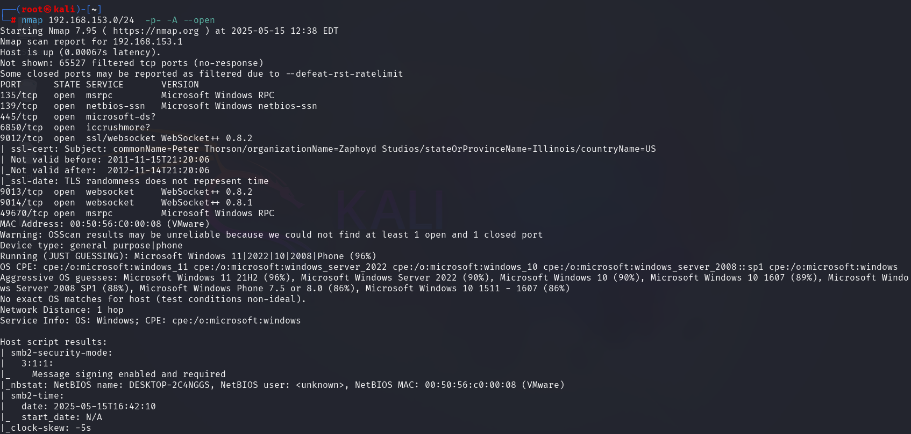
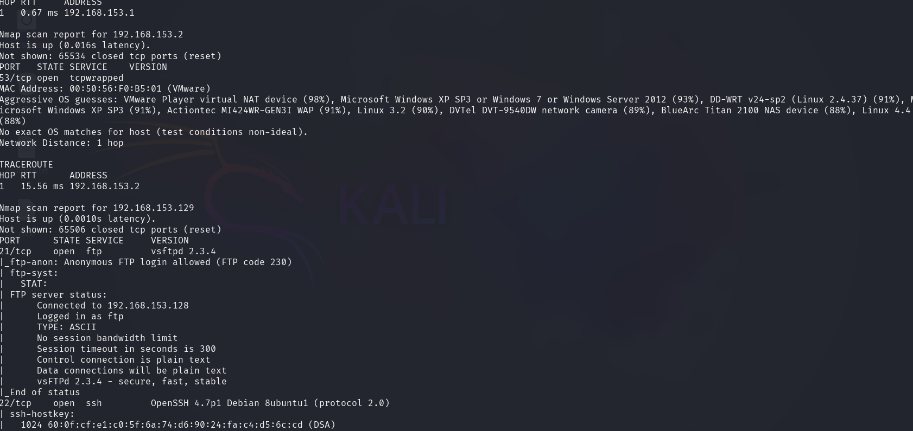
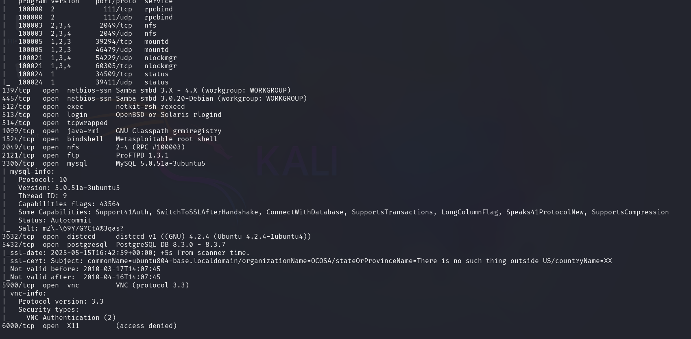
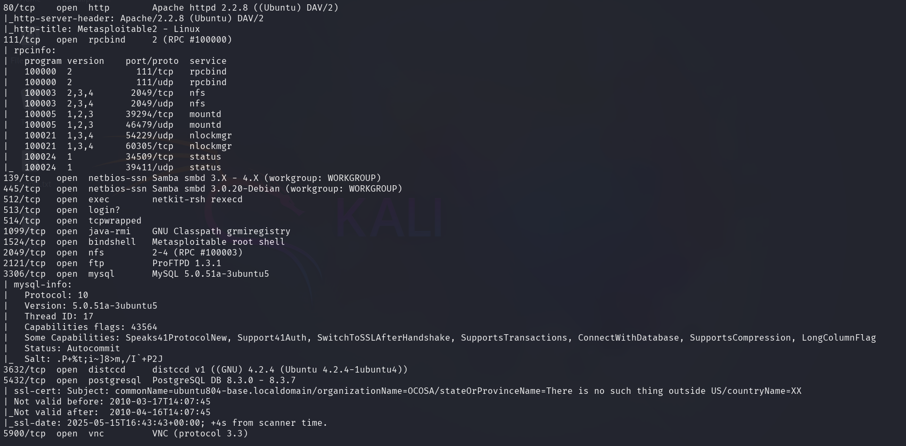
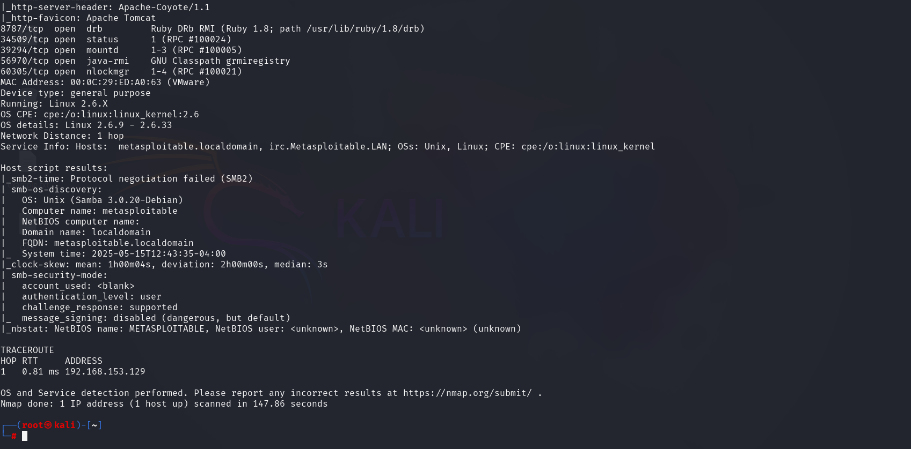
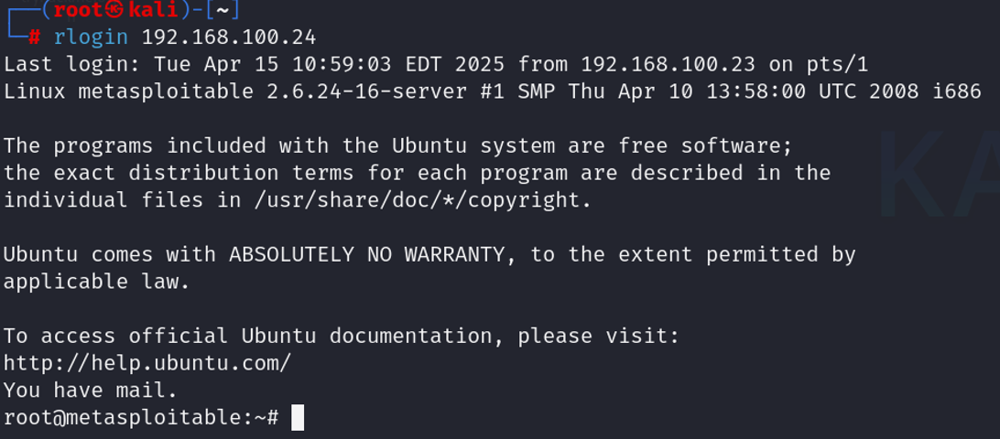

## Şəkillər

### Əsas Şəkillər

## exp
Let's look at port 513 from the Nmap scan and try to infiltrate the system using it.

Let's take a look at how to use rlogin.
The rlogin (remote login) command is a Unix-based utility that allows you to log in to another host on a network using the Remote Login protocol. It's an older method that predates SSH and is generally considered insecure because it transmits data, including passwords, in plaintext.

Since we don't have a username, we only record the hostname.
So, since it is passwordless, we automatically log in to the server

